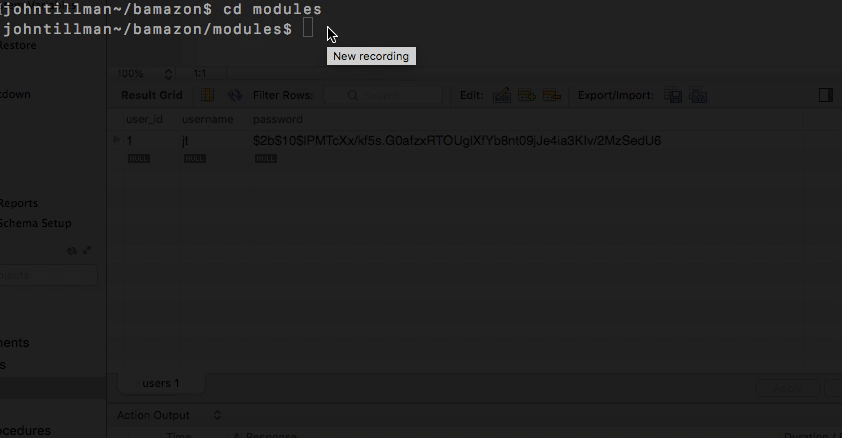

# bamazon

Bamazon is a command line Store Front, written in nodeJS. Customers can buy any item in the store, with Manager and Supervisor views for product and department level management, respectively.

## How to Use

* Customers will run `node bamazonCustomer.js`.

    
* Manager and Supervisor views will require authentication.  
Run `node login.js` to create a username and password, which can be used for both Manager and Supervisor views.

   
* Managers will run `node bamazonManager.js`

    
* Supervisors will run `node bamazonSupervisor.js`

   
* Command prompts in each Store view are self-explanatory, along with the option to remain in the program until you are completely finished with your session.

## Dependencies 

* Custom authentication middleware is provided in the `modules` folder. This was written using the `bcrypt` node package for hashing user passwords. By default these packages are loaded into the `bamazonManager.js` and `bamazonSupervisor.js` files.
* Database management is handled through `MySQL`.
* The `inquirer` npm package for CLI logic.